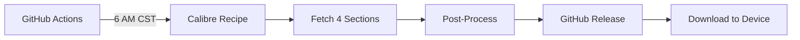

# Bloomberg Daily for CrossPoint E-Ink

Automated daily Bloomberg news fetch optimized for CrossPoint e-ink readers.

## Features

- **Filtered sections**: Only AI, Technology, Industries, Latest (saves bandwidth)
- **Optimized formatting**: Newsreader font, dark mode support, justified text
- **Smart titles**: Article titles shortened for better TOC display
- **Skip intro pages**: Opens directly to first article
- **Daily automation**: GitHub Actions fetches every morning

## How It Works



## Usage

### Automatic (GitHub Actions)
The workflow runs daily at 6:00 AM CST. Check the [Releases](../../releases) page to download the latest EPUB.

### Manual Trigger
1. Go to Actions → "Fetch Bloomberg Daily"
2. Click "Run workflow"
3. Wait ~3-5 minutes
4. Download from Releases

### Local Run
```bash
# Install Calibre first
pip install -r requirements.txt

# Fetch and process
ebook-convert bloomberg_filtered.recipe output/Bloomberg_Raw.epub --output-profile=generic_eink_hd
python process_epub.py output/Bloomberg_Raw.epub output/Bloomberg_$(date +%Y-%m-%d).epub
```

## Configuration

### Change sections
Edit `bloomberg_filtered.recipe` line 10:
```python
ALLOWED_SECTIONS = ['ai', 'technology', 'industries', 'latest']
```

### Change schedule
Edit `.github/workflows/fetch-bloomberg.yml`:
```yaml
schedule:
  - cron: '0 12 * * *'  # 12:00 UTC = 6:00 AM CST
```

### Enable email delivery
1. Add secrets: `MAIL_USERNAME`, `MAIL_PASSWORD`
2. Uncomment the email step in the workflow

## Files

| File | Purpose |
|------|---------|
| `bloomberg_filtered.recipe` | Calibre recipe (4 sections only) |
| `process_epub.py` | Post-processor (skip pages, titles, styling) |
| `stylesheet.css` | Newsreader font + dark mode CSS |
| `fonts/` | Newsreader font files |

## License

For personal use only. Bloomberg content © Bloomberg L.P.
